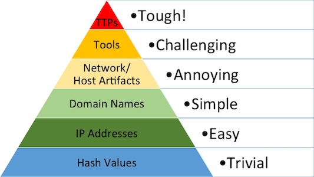

# Cyber Threat Intelligence (CTI) Lab

:soccer: :soccer: :soccer: **Kick-off from TTX** :soccer: :soccer: :soccer:

## CTI Part 1 - Introduction

### The Pyramid of Pain

According to https://www.attackiq.com/glossary/pyramid-of-pain/

### MITRE ATT&CK
- What is [ATT&CK](https://attack.mitre.org)
- Quick tour of the framework
- [ATT&CK Navigator](https://mitre-attack.github.io/attack-navigator/)
- How to search and navigate
  - Enhance Google search using `site:attack.mitre.org`or just `att&ck`
  - [ATT&CK Powered Suit](https://mitre-engenuity.org/cybersecurity/center-for-threat-informed-defense/attack-powered-suit/)
  - Search in ATT&CK Navigator
- Our use cases for ATT&CK
  - Navigator layers for graphical analysis (coverage, attack flow)
  - Technique "lists" to caputre details or for automatic processing (use [STIX/TAXII](https://docs.oasis-open.org/cti/stix/v2.1/stix-v2.1.html) for more advanced use cases)

### SIGMA

### Cyber Kill Chain - Based on MITRE ATT&CK Tactics

### Our Posture from Blue/CTI Perspective
- We have 3 Windows 2019 servers as attack targets
- The servers have standard OS controls (e.g. user permissions) and Microsoft Defender AV as preventive controls
- We have Splunk with a few detections we mostly took from the Sigma repo
- Detection is based on Windows OS logs and Sysmon the configuration of both have been extended/customized
- Some Windows advanced auditing and PowerShell script block logging is activated
- The log/telemetry data is selectively forwarded via the Splunk universal forwarder

### Reasons to do a Purple Team Exercise
- Know/verify posture (detect and prevent)
- Know/verify potential threat impact
- Know/verify processes and capabilities (CTI, controls management, response, etc.)
- Part of structured longterm continuous improvement or even continuous validation
- And others

## CTI Part 2 - Collection & Analysis

### How to Approach the Problem
- How do you go about answering quiestions like "How well are we protected against this threat"?
- What do we have to base our answer on?
- Where/how can we find this?

### Overview & Orientation
- Study these three example sources
  - [Malware Bazaar: Black Basta](https://bazaar.abuse.ch/browse.php?search=tag%3ABlackbasta)
  - [Microsoft, Threat actors misusing Quick Assist in social engineering attacks leading to ransomware](https://www.microsoft.com/en-us/security/blog/2024/05/15/threat-actors-misusing-quick-assist-in-social-engineering-attacks-leading-to-ransomware/)
  - [CISA Advisory: Black Basta](https://www.cisa.gov/sites/default/files/2024-05/aa24-131a-joint-csa-stopransomware-black-basta_1.pdf)
- What are the key differences among them and what do you find usable?
- If you want more information on Black Basta there is more at the bottom of the page
- Define high-level purple team exercise goals (e.g. verify existing basic detect and prevent posture against Black Basta)

### Making it Actionable
- Extract TTPs incl. necessary details/context
- Compile different [ATT&CK Navigator layers](resources/cti/red)
- Create an [adversary profile](resources/adversaryprofile-template.md) to document the actor and the CTI/blue/red "table top"
- Note: Depending on the goals of the exercise (e.g. emulate several different C2 channels) a diffenrent form of documentation may be chosen

### Analyse and Define what to Cover
- Combine the different Navigator layers and decide what to include based on e.g.:
  - Relevance to business and environment (e.g. do we use Linux)
  - Knowledge about posture (level of detection/prevention, complexity/impact of the technique)
    - If available use existing coverage/posture data e.g. as ATT&CK Navigator layers (skipped here since we'll do it after emulation once)
  - Produce clear and relevant results (also in the context of continuous improvement)
- Create the final cumulated [ATT&CK layer](resources/cti/red/cumulated_black_basta_ttps.json)
- Add the final CTI data to the [adversary profile](resources/AdversaryProfile.pdf)
- Add criteria to high-level purple team exercise goals

### Analyse TTPs to Produce the Emulation Plan
- Construct a valid attack path based using combined Navigator layer based on e.g.:
  - Capabilities and knowledge of the red team
  - Requirements for execution of the technique (e.g. disable controls, start with access behind perimeter, have credentials) and the value of the finding
  - Relevance from a red team perspective
  - Expected effort vs. value of the anticipated result in the context of the purple team goals (e.g. creating custom vulnerability exploit code)
- Leverage ATT&CK mapped emulation & detection resources e.g.:
  - [Sigma](https://github.com/SigmaHQ/sigma)
  - [Atomic Red Team](https://github.com/redcanaryco/atomic-red-team)
- Add TTPs not documented in CTI or define handling of gaps and tradeoffs to complete attack flow as necessary
- Document the results in the adversary profile
- Add criteria to high-level purple team exercise goals
- Create the [emulation plan](emulation.md)

## Emulation Time!

:champagne: See you later :wave:

## Supplemental References
| Title | URL |
| ----------- | ----------- |
| CISA Advisory: Black Basta | https://www.cisa.gov/sites/default/files/2024-05/aa24-131a-joint-csa-stopransomware-black-basta_1.pdf |
| Threat Actor Groups, Including Black Basta, are Exploiting Recent ScreenConnect Vulnerabilities | https://www.trendmicro.com/en_us/research/24/b/threat-actor-groups-including-black-basta-are-exploiting-recent-.html |
| Ransomware Spotlight: Black Basta | https://www.trendmicro.com/vinfo/us/security/news/ransomware-spotlight/ransomware-spotlight-blackbasta |
| Black Basta Ransomware | https://www.sentinelone.com/labs/black-basta-ransomware-attacks-deploy-custom-edr-evasion-tools-tied-to-fin7-threat-actor/ |
| Black Basta | https://attack.mitre.org/software/S1070/ |
| Ransomware Attackers May Have Used Privilege Escalation Vulnerability as Zero-day | https://symantec-enterprise-blogs.security.com/threat-intelligence/black-basta-ransomware-zero-day |
| Black Basta - BLACK BASTA BUSTER: DECRYPTING FILES WITHOUT PAYING THE RANSOM | https://www.srlabs.de/blog-post/black-basta-buster-decrypting-files-without-paying-the-ransom |
| Threat Assessment: Black Basta Ransomware| https://unit42.paloaltonetworks.com/threat-assessment-black-basta-ransomware/ |
| Black Basta - Technical Analysis | https://www.kroll.com/en/insights/publications/cyber/black-basta-technical-analysis |
| Black Basta Ransomware Analysis, Simulation, and Mitigation | https://www.picussecurity.com/resource/blog/black-basta-ransomware-analysis-cisa-alert-aa24-131a |
| Ongoing Social Engineering Campaign Linked to Black Basta Ransomware Operators | https://www.rapid7.com/blog/post/2024/05/10/ongoing-social-engineering-campaign-linked-to-black-basta-ransomware-operators/ |
| Threat actors misusing Quick Assist in social engineering attacks leading to ransomware | https://www.microsoft.com/en-us/security/blog/2024/05/15/threat-actors-misusing-quick-assist-in-social-engineering-attacks-leading-to-ransomware/ |
| Threat Actor Groups, Including Black Basta, are Exploiting Recent ScreenConnect Vulnerabilities | https://www.trendmicro.com/en_us/research/24/b/threat-actor-groups-including-black-basta-are-exploiting-recent-.html |
| Black Basta ransomware switches to more evasive custom malware | https://www.bleepingcomputer.com/news/security/black-basta-ransomware-switches-to-more-evasive-custom-malware/ |
